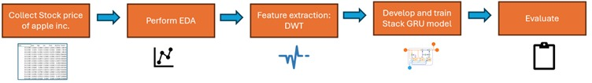

# Time Series Forecasting using Stacked GRU and DWT

## 1. Introduction

The objective of this research is to create a strong and precise model for forecasting the stock prices of Apple Inc. by using sophisticated machine learning methods. This study will focus on the use of normalization with Min-Max scaling, feature extraction via Discrete Wavelet Transform (DWT), and prediction through a stacked Gated Recurrent Unit (GRU) model. The aim is to analyze complex patterns and time-based relationships in stock price data, providing accurate predictions to assist in making well-informed investment choices.

## 1.1 Aim

The primary aim of this research is to develop an accurate and robust model for forecasting Apple Inc.'s stock prices using advanced machine learning techniques, including stacked GRU layers and DWT for feature extraction.

## 1.2 Research Questions

- **RQ1**: What is the impact of using several stacked GRU layers on the model's performance in forecasting stock prices, particularly in terms of accuracy and the ability to capture complex temporal relationships, compared to a single-layer GRU model?
- **RQ2**: How does the use of Discrete Wavelet Transform (DWT) for feature extraction affect the overall performance of the stacked GRU model, in terms of prediction accuracy and computational efficiency, compared to models that do not use DWT?

## 2. Dataset

The stock price data for Apple Inc. was sourced from Yahoo Finance, a reliable provider of financial news and data. The dataset includes important financial indicators such as opening and closing prices, daily highs and lows, trading volume, and adjusted closing prices. The dataset can be accessed via the following link: [Apple Inc. Historical Data on Yahoo Finance](https://finance.yahoo.com/quote/AAPL/history/?period1=345479400&period2=1717515373&guccounter=1).

## 3. Methodology

The methodology employed in this project is composed of five key components:

1. **Data Collection**: Historical stock price data for Apple Inc. is collected, including opening and closing prices, daily highs and lows, trading volume, and other relevant attributes.
2. **Exploratory Data Analysis (EDA)**: EDA is performed to understand the data trends and identify any necessary preprocessing steps.
3. **Feature Extraction using Discrete Wavelet Transform (DWT)**: DWT is applied to partition the data into discrete temporal and frequency components, uncovering intricate patterns in the stock price data.
4. **Model Development**: A stacked GRU model is developed and trained using the extracted features, leveraging GRU's ability to handle sequential input data.
5. **Model Evaluation**: The model's accuracy and reliability in predicting stock prices are evaluated using metrics such as Root Mean Square Error (RMSE). This systematic approach ensures that the predictions are both accurate and efficient.



## 4. Libraries Used

- pandas
- matplotlib
- seaborn
- pywt
- numpy
- scikit-learn
- tensorflow

## 5. How to Execute the Script

To run the project code, follow these steps:

1. **Clone the GitHub Repository**:
   ```bash
   git clone https://github.com/sushmitha2721/time_series_forecasting
   cd time_series_forecasting
2. Install anaconda fron: https://www.anaconda.com/ 
3. Install the above libraries using pip: !pip install pandas matplotlib seaborn pywt numpy scikit-learn tensorflow
4. Run the Jupyter Notebook: Start Jupyter Notebook
3. Locate the CLoned folder from jupyter notebook
6. Open final_project_code and run the code.
